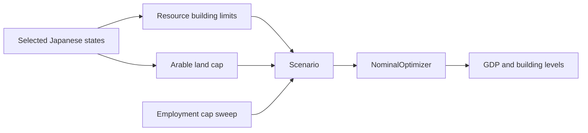

# Resource-limited optimization

This example combines state-region resource potential, arable land, banned
non-economic building groups, and an era-5 technology cap. It uses selected
Japanese states to demonstrate a reusable GDP optimization under autarky for
employment caps from one million to one hundred million.

<!-- table-preview: tables/optimize_jap.csv | columns=employment_cap,annual_gdp,employment,gdp_per_capita,construction_cost,arable_land_consumption | rows=5 -->

[:material-download: Download `tables/optimize_jap.csv`](../tables/optimize_jap.csv)
· [:fontawesome-brands-github: View `examples/optimize_jap.py`](https://github.com/ShabbyGayBar/victoria3-analysis/blob/DEV/examples/optimize_jap.py)

```bash
uv run python -m examples.optimize_jap
```

## How the constraints compose



The important implementation pattern is that state-region helpers return
ordinary limits consumed by `Scenario`; the optimizer does not need a
country-specific code path. See the [economy guide](../guides/economy.md) and
[optimization API](../api/optimization.md).
